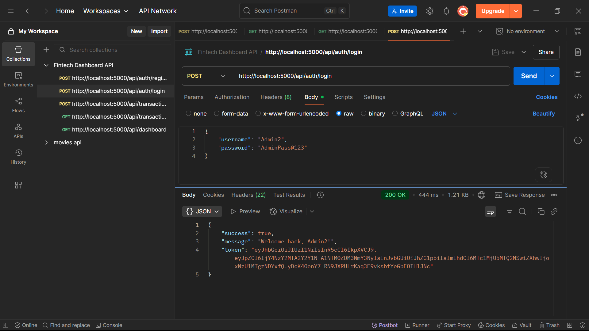
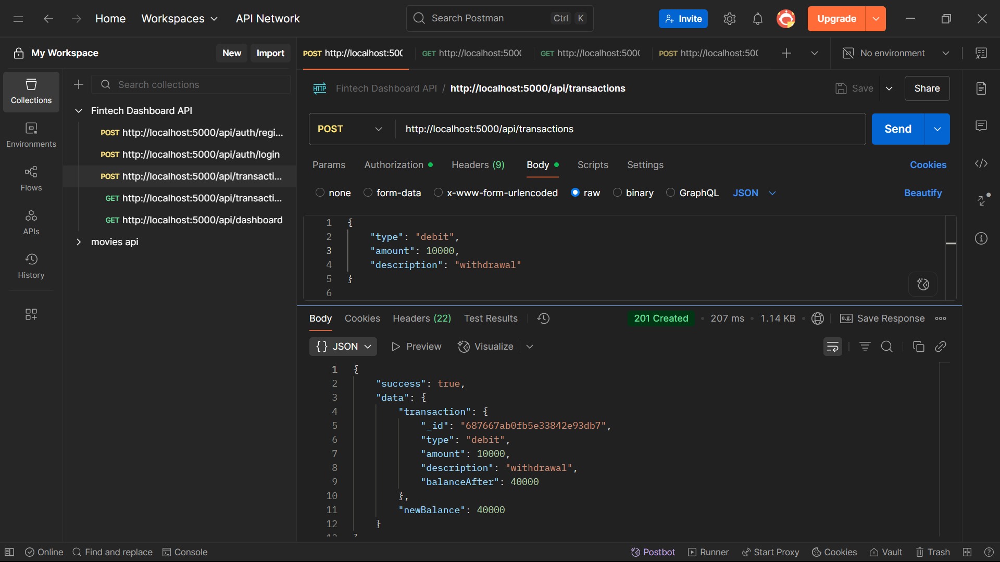
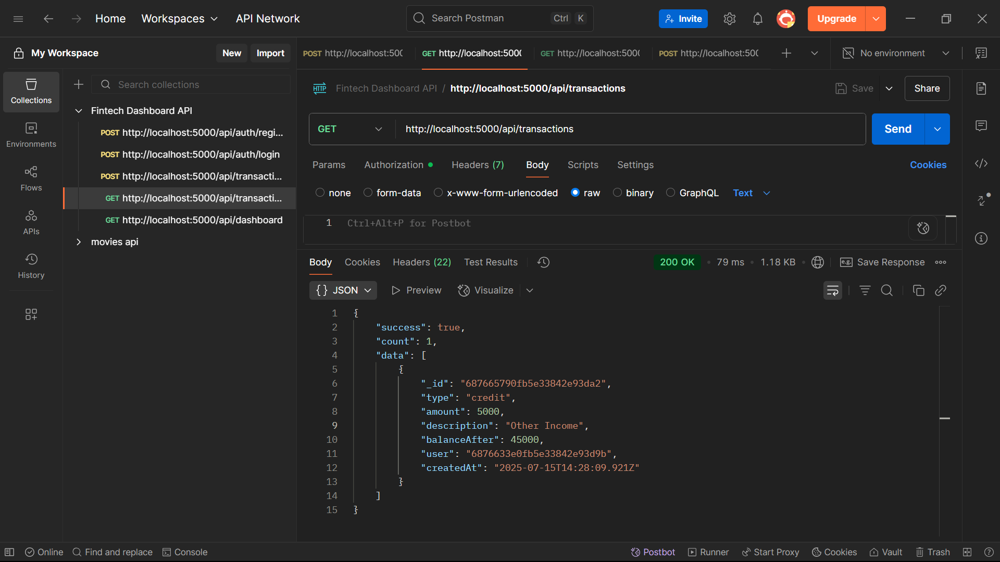
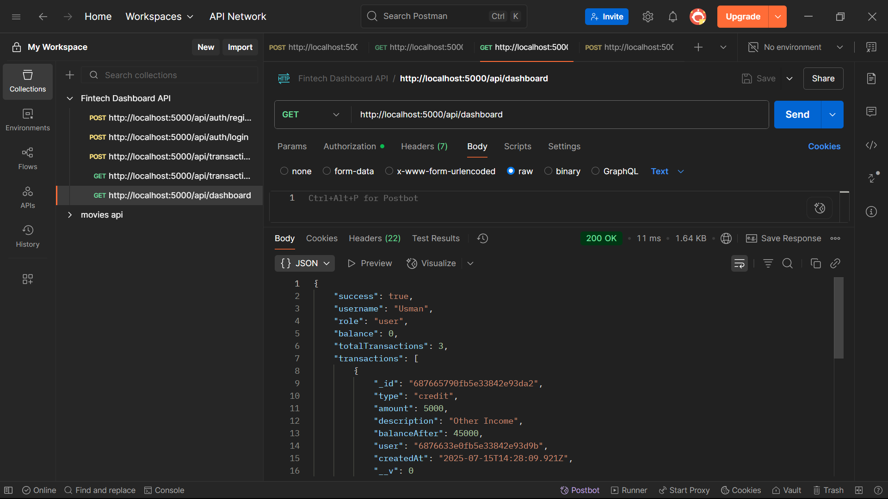

# Fintech Dashboard API Postman Collection

## Collection Details
- Version: 2.1
- Contains all working API endpoints
- Tested on: 15th July, 2025

## Images









# File Upload Instructions

## Overview
This API provides endpoints for uploading images and videos with authentication. Files are stored locally with automatic directory creation and unique filename generation.

## Postman Testing Guide

## Prerequisites
1. Ensure your server is running
2. You have a valid authentication token (JWT)
3. Upload directories exist (`uploads/images/` and `uploads/videos/`)


## 🖼️ Uploading an Image

### Step 1: Set up the Request
- **Method:** `POST`
- **URL:** `http://localhost:5000/api/profile/upload-image`

### Step 2: Add Authentication
- Go to the **Authorization** tab
- Select **Type:** `Bearer Token`
- **Token:** Enter your JWT token

### Step 3: Configure Request Body
- Go to the **Body** tab
- Select **form-data**
- Add a new key-value pair:
  - **Key:** `file` (make sure to select **File** type from dropdown)
  - **Value:** Click "Select Files" and choose your image file

### Step 4: Send Request
- Click **Send**

### Expected Response (Success):
```json
{
  "success": true,
  "data": {
    "profileImage": "/uploads/images/img-1234567890-abc123.jpg",
    "filename": "img-1234567890-abc123.jpg",
    "size": 1048576
  }
}
```

### Supported Image Formats:
- JPEG (`.jpeg`, `.jpg`)
- PNG (`.png`)
- GIF (`.gif`)
- Maximum size: 20MB

---

## 🎥 Uploading a Video

### Step 1: Set up the Request
- **Method:** `POST`
- **URL:** `http://localhost:5000/api/profile/upload-video`


### Step 2: Add Authentication
- Go to the **Authorization** tab
- Select **Type:** `Bearer Token`
- **Token:** Enter your JWT token

### Step 3: Configure Request Body
- Go to the **Body** tab
- Select **form-data**
- Add a new key-value pair:
  - **Key:** `file` (make sure to select **File** type from dropdown)
  - **Value:** Click "Select Files" and choose your video file

### Step 4: Send Request
- Click **Send**

### Expected Response (Success):
```json
{
  "success": true,
  "data": {
    "videoPath": "/uploads/videos/vid-1234567890-def456.mp4",
    "filename": "vid-1234567890-def456.mp4",
    "size": 5242880
  }
}
```

### Supported Video Formats:
- MP4 (`.mp4`)
- MOV (`.mov`)
- Maximum size: 20MB

---

## 🚨 Common Error Responses

### No File Uploaded (400):
```json
{
  "success": false,
  "error": "Please upload an image file"
}
```

### Invalid File Type (400):
```json
{
  "success": false,
  "error": "Only image files (jpeg, jpg, png, gif) are allowed!"
}
```

### File Too Large (413):
```json
{
  "success": false,
  "error": "File too large"
}
```

### Unauthorized (401):
```json
{
  "success": false,
  "error": "Not authorized, token failed"
}
```

### Server Error (500):
```json
{
  "success": false,
  "error": "Internal server error message"
}
```